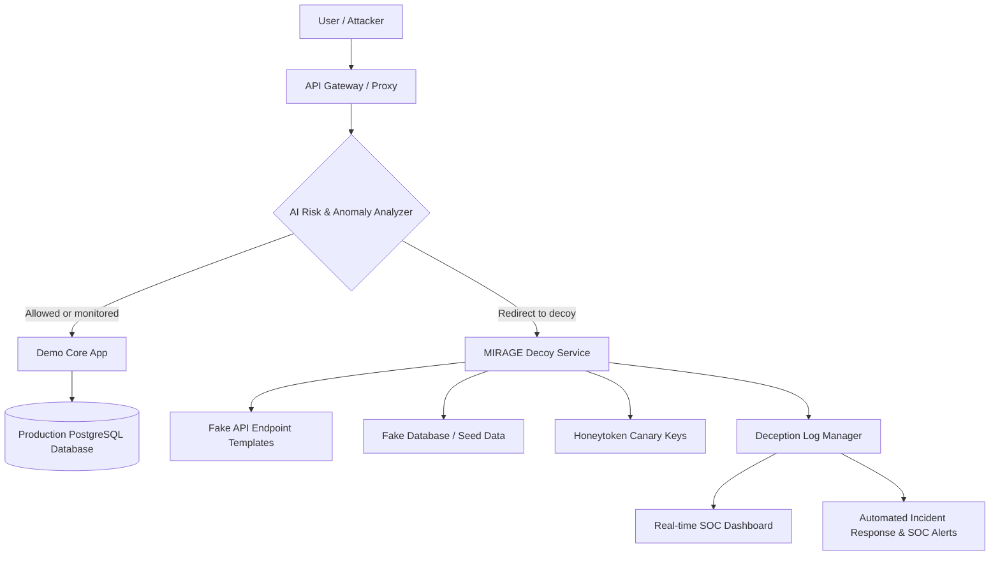

# Project MIRAGE
### Autonomous AI-Driven Cyber Deception & Threat Mitigation Platform

[](https://nextjs.org/)
[](https://fastapi.tiangolo.com/)
[](https://scikit-learn.org/)
[](https://www.postgresql.org/)
[](https://tailwindcss.com/)
[](https://www.docker.com/)

---

Project MIRAGE is an autonomous cybersecurity defense platform that secures modern APIs and application infrastructures. By combining real-time AI risk scoring with dynamic decoy containment, MIRAGE doesn't just block attacks—it absorbs, analyzes, and neutralizes them inside simulated execution sandboxes. The system dynamically redirects suspicious vectors into high-fidelity synthetic environments, exposing decoy databases and honeytoken credentials while generating threat intelligence to harden production systems.

---

## Implementation Status

As of 2026-06-22, this repository is a local MVP rather than the complete target
platform described in the proposal. It provides request metadata inspection,
heuristic scoring, a guarded reverse-proxy route, isolated real and static decoy
services, persistent logging, dashboard polling, ML-ready feature storage, and
an offline Random Forest training pipeline.

Arbitrary ingress proxying, a deployed ML artifact, adaptive decoys,
honeytoken-use tracking, WebSocket updates, and cloud deployment remain planned.
See `docs/PROPOSAL_ALIGNMENT.md` for the detailed comparison.

## Technical Overview

### The Problem: Passive Firewalls & Alert Fatigue
Modern enterprise infrastructures face massive automated probes, zero-day vulnerabilities, and credential stuffing vectors. Traditional firewalls and intrusion prevention systems (IPS) operate on static blacklists, blocking requests flatly. This provides attackers with immediate feedback, allowing them to cycle payloads, rotating IPs, and mutate payloads until they bypass static rules. Concurrently, SOC analysts suffer from alert fatigue, sorting through millions of blocked requests to identify high-risk advanced persistent threats (APTs).

### The MIRAGE Approach: Active Cyber Deception
Project MIRAGE transforms cybersecurity from a passive defense posture to an **active deception campaign**. Instead of rejecting suspicious traffic with a `403 Forbidden` response, MIRAGE routes anomalies to an isolated container network:
- **Intrusion Detention**: Attackers believe they have successfully breached an endpoint. They waste resources exploring fake directories, scraping synthetically generated tables, and testing invalid API tokens.
- **Signal Hardening**: While the attacker is trapped, MIRAGE logs behavioral fingerprints, tracks command payloads, and flags their IP ranges across the network.
- **Honeytoken Traps**: Dynamic honeytoken files (e.g., false `.env` configurations or AWS credential keys) are leaked to the attacker. If the attacker attempts to use these credentials on actual cloud infrastructure, alert systems trigger immediate lockouts.

---

## Core Features

### 🧠 AI Risk Scoring & Anomaly Detection
Analyzes incoming headers, body payload signatures, routing behaviors, and request frequencies.
* **Security Purpose**: Employs isolation scoring to isolate zero-day exploit patterns and credential stuffing attempts that bypass traditional signature-based Web Application Firewalls (WAF).

### 🕸️ Dynamic Decoy Environments
Constructs a sandboxed network mimic layer loaded with fake schemas and endpoints.
* **Security Purpose**: Distracts and detains attackers inside a synthetic system, exhausting their time and resources while tracking their manual exploitation flows.

### 🔑 Canary Token System
Injects dynamically generated false credentials, dummy database strings, and honeytoken environment configs (`.env`) into decoy filesystems.
* **Security Purpose**: Generates high-confidence alert signals the moment canary credentials are exfiltrated and tested against actual system endpoints.

### 🔬 Threat Analysis Engine
Generates detailed command footprints, fingerprint logs, and payloads from trapped attackers.
* **Security Purpose**: Transforms active attacks into structured intelligence data, allowing operators to patch production gaps before real damage can occur.

### 📡 SOC Analytics Dashboard & Real-Time Alerts
A unified dashboard built on high-fidelity animations, real-time threat maps, and visual system states.
* **Security Purpose**: Streamlines security operations by highlighting critical risk anomalies and decoy redirect events while silencing standard noise.

---

## Architecture Flow

The diagram below outlines how the MIRAGE API Gateway routes traffic dynamically based on AI evaluation:



### Request Lifecycle
1. **Ingress**: Traffic hits the API Gateway.
2. **Analysis**: Request metadata is evaluated by the AI Risk Scorer.
3. **Branching**:
   - **Allowed**: Routed directly to production databases and APIs.
   - **Redirected**: Routed to the Decoy Container without dropping the connection, keeping the HTTP headers indistinguishable to the attacker.
4. **Deception**: The attacker interacts with mock endpoints, extracting fake data.
5. **Mitigation**: Logs are pushed to the security dashboard, and alerts are dispatched via secure webhooks.

---

## Technology Stack

```
   ┌─────────────────────────────────────────────────────────────┐
   │                       PROJECT MIRAGE                        │
   └─────────────────────────────────────────────────────────────┘
          │                           │                       │
          ▼                           ▼                       ▼
   ┌──────────────┐            ┌──────────────┐        ┌──────────────┐
   │   FRONTEND   │            │   BACKEND    │        │ DATA & DEPLOY│
   ├──────────────┤            ├──────────────┤        ├──────────────┤
   │ Next.js      │            │ FastAPI      │        │ SQLite       │
   │ Tailwind v4  │            │ Uvicorn      │        │ PostgreSQL   │
   │ Framer Motion│            │ SQLAlchemy   │        │ Docker       │
   │ Recharts     │            │ Pydantic     │        │ Vercel       │
   │ TypeScript   │            │ pytest       │        │ Railway      │
   └──────────────┘            └──────────────┘        └──────────────┘
```

- **Frontend Dashboard**: React and Next.js App Router for server-rendered page assets. Styled with Tailwind CSS v4, Framer Motion transitions, and Recharts graph animations.
- **Backend Services**: FastAPI implementation utilizing Uvicorn for asynchronous high-throughput request handling. Database interactions managed via SQLAlchemy models and Pydantic schemas with SQLite (development) and PostgreSQL (production) support.
- **AI Core**: Heuristic-based risk scoring and anomaly detection engine. Scikit-Learn classification planned for future enhancement.
- **Infrastructure**: Containerized using Docker Compose for staging multi-container decoy clusters.

---

## Project Structure

```
mirage/
├── apps/
│   ├── web/                  # Next.js frontend (landing page + dashboard)
│   │   ├── src/app/          # App Router pages
│   │   ├── src/components/   # UI components (landing, dashboard, layout, ui)
│   │   └── src/lib/          # Utilities, mock data, constants
│   ├── gateway/              # FastAPI backend (API gateway)
│   │   ├── app/api/          # Route endpoints (inspect, dashboard, decoy, simulate)
│   │   ├── app/core/         # Config, CORS
│   │   ├── app/schemas/      # Pydantic models
│   │   ├── app/services/     # Risk engine, decision, decoy, logger
│   │   ├── app/storage/      # Database (SQLite/PostgreSQL) + memory fallback
│   │   └── tests/            # pytest tests
│   ├── decoy/                # Decoy environment (placeholder)
│   └── real-app-demo/        # Demo protected app (placeholder)
├── packages/
│   └── shared/               # Shared types/config (placeholder)
├── docs/                     # Architecture docs, demo flow
├── infra/
│   └── docker-compose.yml    # Docker orchestration
├── .env.example              # Root environment template
└── README.md
```

---

## Landing Page Philosophy
The MIRAGE landing page layout is inspired by **MotionSites AI** and high-end enterprise SaaS architectures:
- **Cinematic Backdrop**: Replaced traditional static grids with a fullscreen HLS video background running an active cybernetic topology feed.
- **Cyberpunk Minimalism**: Uses HSL colors, cyan and emerald accents, and glassmorphic panels built on `backdrop-blur-xl` and low opacity borders.
- **Asymmetrical Balance**: Visual components are arranged to frame the typography organically, avoiding rigid grids.
- **Focused Hierarchy**: The screen centers on the primary headline `DETECT. DECEIVE. DEFEND.` while the active gauges and anomaly chart widgets drift slowly in the background as ambient HUD indicators.

---

## Installation & Setup

### Prerequisites
- Node.js v20+
- Python v3.11+

### 1. Clone the Repository
```bash
git clone https://github.com/rafienajwan/mirage.git
cd mirage
```

### 2. Run the Backend (FastAPI Gateway)
```bash
cd apps/gateway
python -m venv venv
# Windows:
venv\Scripts\activate
# Linux/Mac: source venv/bin/activate

python -m pip install -e ".[dev,ml,postgres]"
# Windows: Copy-Item .env.example .env
# Linux/macOS: cp .env.example .env
# Fill MIRAGE_API_KEY and the DECOY_* values in apps/gateway/.env.
python -m alembic upgrade head
uvicorn app.main:app --reload --port 8000
```
API docs: [http://localhost:8000/docs](http://localhost:8000/docs)

### 3. Run the Frontend (Next.js)
```bash
cd apps/web
npm install
npm run dev
```
Frontend: [http://localhost:3000](http://localhost:3000)

### 4. Run the Full Docker Stack

Copy the root template and fill every variable marked `REQUIRED`. The
`POSTGRES_PASSWORD` value must be URL-safe and must match the password embedded
in `DATABASE_URL`. Decoy variables must contain synthetic values only; never put
credentials from a real system in them.

```bash
# Windows: Copy-Item .env.example .env
# Linux/macOS: cp .env.example .env

docker compose --env-file .env -f infra/docker-compose.yml up --build
```

The root `.env` is ignored by Git. Share configuration names through
`.env.example`, never by committing `.env`.

---

## MVP Demonstration Flow

To demonstrate the MIRAGE active containment workflow:

1. **Traffic Entry**: Simulate a normal API request:
   ```bash
   curl -X POST http://localhost:8000/api/v1/simulate/normal
   ```
   *Response*: Returns `decision: allow` with a low risk score.

2. **Attack Probe**: Simulate a suspicious request:
   ```bash
   curl -X POST http://localhost:8000/api/v1/simulate/suspicious
   ```
   *Response*: The AI Risk Scorer evaluates the request as highly anomalous. Returns `decision: redirect_to_decoy`.

3. **Dashboard Check**: Open [http://localhost:3000/dashboard](http://localhost:3000/dashboard) to see the real-time security dashboard with logged events, risk scores, and active alerts.

4. **Inspect Endpoint**: Send a custom request for analysis:
   ```bash
   curl -X POST http://localhost:8000/api/v1/inspect \
     -H "Content-Type: application/json" \
     -d '{"ip_address": "10.0.0.1", "method": "GET", "path": "/api/users", "user_agent": "Mozilla/5.0", "request_count": 5, "payload_indicators": []}'
   ```

---

## Running Tests

```bash
cd apps/gateway
pytest tests/ -v
```

---

## Future Roadmap

- **Frontend ↔ Backend Integration**: Connect the dashboard to live backend API endpoints for real-time event data.
- **Canary/Honeytoken System**: Inject fake credentials (AWS keys, DB strings) into decoy responses.
- **ML Model Integration**: Replace heuristic scoring with a trained Scikit-Learn classifier.
- **Rate Limiting & API Auth**: Add `slowapi` middleware and optional API key authentication.
- **LLM Threat Analysis**: Integrate small language models to dynamically generate fake code outputs based on attacker commands.
- **AI Fingerprinting**: Implement behavioral graph clustering to identify repeat attackers across rotated IPs and User-Agents.
- **Honeynet Orchestration**: Deploy Kubernetes operators to spin up temporary Docker container decoys on-demand.
- **SIEM / SOC Connectors**: Out-of-the-box integrations with Splunk, Datadog, Slack, and PagerDuty.

---

## License

This project is developed for educational and demonstration purposes.
