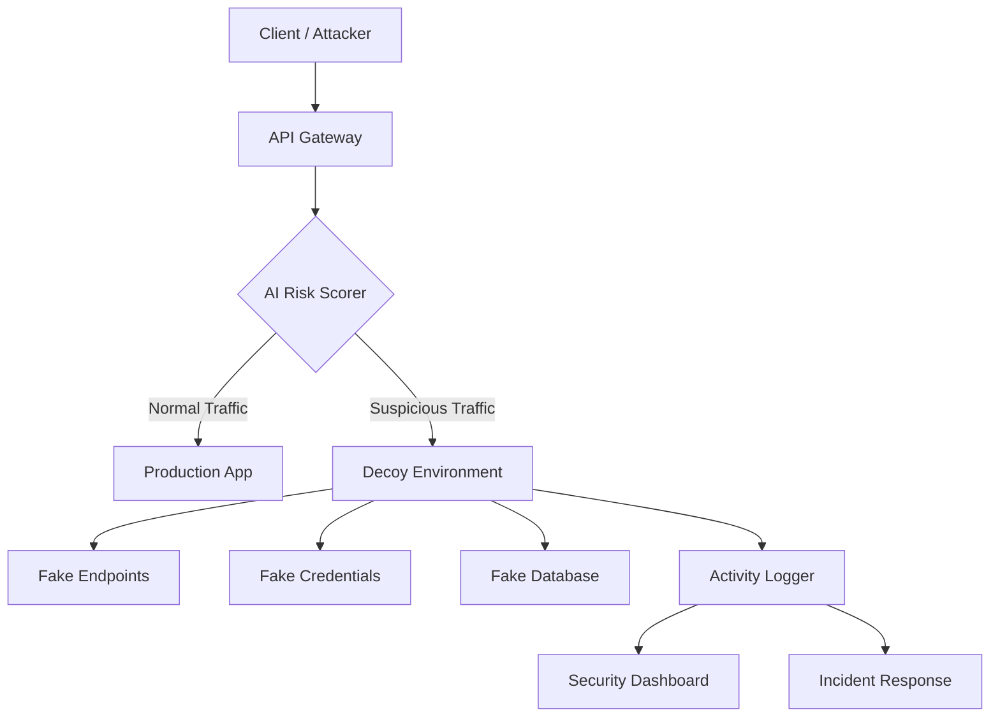

# Project MIRAGE

### AI-Powered Cyber Deception Defense Platform

[](https://nextjs.org/)
[](https://tailwindcss.com/)
[](https://www.typescriptlang.org/)

---

Project MIRAGE is an AI-powered cyber deception defense platform for API security. It detects suspicious API requests, calculates risk scores, redirects attackers into safe decoy environments, records attacker behavior, and visualizes threats through a security dashboard.

## Current Status

**Frontend Foundation** — The landing page and security dashboard are implemented with polished UI, responsive layout, and realistic mock cybersecurity data. Backend services are planned for future development.

### What works now

- Cinematic dark-themed landing page with hero section
- Responsive header with mobile navigation
- Security dashboard with metric cards, traffic charts, and risk score visualization
- Threat activity feed with severity labels
- Decoy environment status panel
- Alert panel with severity indicators
- All data is safe mock data — no real exploits or credentials

### Planned for future

- FastAPI defense gateway with AI risk scoring
- Decoy routing service and sandbox environments
- Anomaly detection engine
- Database logging with PostgreSQL
- Real-time WebSocket updates

## Core Concepts

| Concept | Description |
|---------|-------------|
| AI Risk Scoring | Evaluates incoming requests for anomaly indicators |
| Anomaly Detection | Identifies patterns deviating from normal traffic |
| Threat Fingerprinting | Records behavioral signatures from trapped attackers |
| Decoy Environment | Isolated sandbox mimicking production systems |
| Fake Endpoint | Simulated API routes returning fabricated data |
| Fake Credential | Honeytoken credentials that trigger alerts when used |
| Fake Response | Realistic but fabricated API responses |
| Activity Logger | Records all attacker interactions within decoy |
| Security Dashboard | Real-time visualization of threats and system status |
| Incident Response | Automated alerting and containment workflows |

## Architecture



## Project Structure

```
mirage/
├── apps/
│   ├── web/              # Next.js frontend — landing page + dashboard
│   ├── gateway/          # Placeholder for FastAPI defense gateway
│   ├── decoy/            # Placeholder for decoy service
│   └── real-app-demo/    # Placeholder for protected demo app
├── packages/
│   └── shared/           # Shared types and constants
├── docs/
│   ├── architecture.md
│   └── demo-flow.md
├── infra/
│   └── docker-compose.yml
├── .env.example
└── README.md
```

## Running Locally

### Prerequisites

- Node.js v20+

### Setup

```bash
# Clone the repository
git clone https://github.com/rafienajwan/mirage.git
cd mirage

# Navigate to the web app
cd apps/web

# Install dependencies
npm install

# Start the development server
npm run dev
```

Open [http://localhost:3000](http://localhost:3000) to view the landing page.

Navigate to [http://localhost:3000/dashboard](http://localhost:3000/dashboard) to view the security dashboard.

### Build

```bash
cd apps/web
npm run build
npm start
```

## Technology Stack

| Layer | Technology |
|-------|-----------|
| Frontend Framework | Next.js 16 (App Router) |
| Styling | Tailwind CSS v4 |
| Animations | Framer Motion |
| Charts | Recharts |
| Icons | Lucide React |
| Language | TypeScript 5 |
| Backend (Planned) | FastAPI + Uvicorn |
| Database (Planned) | PostgreSQL |
| AI Engine (Planned) | Scikit-Learn |

## License

This project is developed for educational and demonstration purposes.
