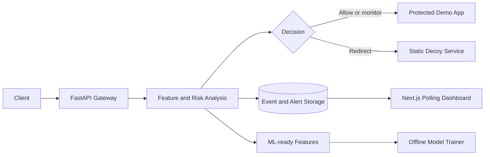

# Project MIRAGE

Project MIRAGE is an experimental cyber-deception platform for API traffic. The
current repository is a local MVP: a guarded FastAPI proxy scores requests with
heuristics, forwards normal traffic to a protected demo app, redirects suspicious
traffic to an isolated static decoy, persists security events, and exposes them
through a polling Next.js dashboard.

The broader adaptive-ML, per-attacker honeytoken issuance/rotation, WebSocket,
and cloud-deployment capabilities remain proposal targets. See
`docs/PROPOSAL_ALIGNMENT.md` for the exact implementation gap.

## What Works

- guarded reverse proxy at `/api/v1/proxy/*`;
- heuristic risk scoring, anomaly signals, fingerprints, and payload indicators;
- isolated protected-demo and static-decoy services;
- bounded request bodies, upstream timeouts, credential filtering, and rate limits;
- SQLite development storage and PostgreSQL/Alembic support;
- dashboard metrics, events, alerts, traffic history, and simulation controls;
- ML-ready feature vectors, optional ML shadow scoring, and an offline Random Forest training pipeline;
- analyst event labels for future training data curation;
- JSONL export and readiness checks for analyst-labeled training records;
- dataset preparation adapters for MIRAGE JSONL and CICIDS-style CSV sources;
- honeytoken detection for configured decoy credentials;
- computed actor profiles from fingerprints, event history, and honeytoken hits;
- Docker Compose configuration for the five-service demo stack.

## Current Boundaries

- The gateway only proxies its explicit `/api/v1/proxy/*` route.
- Runtime routing uses heuristics; trained artifacts can be observed in shadow mode.
- Decoy responses are static; configured decoy credential reuse is tracked, but
  per-attacker honeytoken issuance is not implemented.
- Dashboard updates use 10-second HTTP polling rather than WebSocket.
- Docker image builds and cloud deployment are not yet verified in CI.

## Architecture



| Service | Local port | Purpose |
| --- | ---: | --- |
| Web | `3000` | Landing page, dashboard, and server-side simulation bridge |
| Gateway | `8000` | Inspection, proxy routing, dashboard API, and persistence |
| Protected demo app | `8001` | Upstream for allowed or monitored traffic |
| Decoy | `8002` | Upstream with static synthetic responses |
| PostgreSQL | internal | Compose persistence backend |

## Quick Start

### Prerequisites

- Docker Desktop with Docker Compose; or
- Node.js 20+ and Python 3.11+ for standalone development.

### Full Stack With Docker

From the repository root:

```bash
# Windows
Copy-Item .env.example .env

# Linux/macOS
cp .env.example .env
```

Fill every variable marked `REQUIRED` in `.env`:

- `POSTGRES_PASSWORD` must be strong and URL-safe.
- `DATABASE_URL` must use the `postgresql+asyncpg` driver, host `db`, and the
  same user, password, and database configured by `POSTGRES_*`.
- `MIRAGE_API_KEY` protects operator write endpoints and the dashboard simulation bridge.
- `DECOY_*` values must be synthetic and invalid on every real system.

Then start the stack:

```bash
docker compose --env-file .env -f infra/docker-compose.yml up --build
```

Open:

- dashboard: `http://localhost:3000/dashboard`;
- gateway docs: `http://localhost:8000/docs`;
- gateway health: `http://localhost:8000/health`.

Stop the stack with:

```bash
docker compose --env-file .env -f infra/docker-compose.yml down
```

The root `.env` is ignored by Git. Commit variable names and documentation only
through `.env.example`.

## Demo

With the full stack running, send normal traffic through the proxy:

```bash
curl -H "User-Agent: Mozilla/5.0" http://localhost:8000/api/v1/proxy/api/products
```

Send a suspicious probe to exercise decoy routing:

```bash
curl -H "User-Agent: sqlmap/1.8" http://localhost:8000/api/v1/proxy/.env
```

Open `http://localhost:3000/dashboard` to inspect the resulting events and
alerts. The dashboard simulation buttons call a server-side Next.js route, so
`MIRAGE_API_KEY` is never exposed in the browser bundle.

For a direct operator simulation call:

```bash
curl -X POST -H "X-Mirage-API-Key: YOUR_LOCAL_MIRAGE_API_KEY" http://localhost:8000/api/v1/simulate/suspicious
```

## Standalone Development

Run each backend service in a separate terminal from the repository root.

### Gateway

```bash
cd apps/gateway
python -m venv .venv
# Windows: .venv\Scripts\activate
# Linux/macOS: source .venv/bin/activate
python -m pip install -e ".[dev,ml,postgres]"
# Windows: Copy-Item .env.example .env
# Linux/macOS: cp .env.example .env
python -m alembic upgrade head
uvicorn app.main:app --reload --port 8000
```

### Protected Demo App

```bash
cd apps/real-app-demo
python -m pip install -e .
uvicorn app.main:app --reload --port 8001
```

### Decoy

```bash
cd apps/decoy
python -m pip install -e .
uvicorn app.main:app --reload --port 8002
```

### Web

Copy `apps/web/.env.example` to `apps/web/.env.local`. Set
`MIRAGE_INTERNAL_API_URL` to the standalone gateway and use the same
`MIRAGE_API_KEY` configured by the gateway.

```bash
cd apps/web
npm install
# Windows: Copy-Item .env.example .env.local
# Linux/macOS: cp .env.example .env.local
npm run dev
```

## Gateway API

All paths below use the `http://localhost:8000` base URL.

| Method and path | Auth | Purpose |
| --- | --- | --- |
| `GET /health` | Public | Health check |
| `POST /api/v1/inspect` | API key | Inspect submitted request metadata |
| `* /api/v1/proxy/{path}` | Public | Inspect and forward real HTTP traffic |
| `POST /api/v1/simulate/normal` | API key | Generate a normal demo event |
| `POST /api/v1/simulate/suspicious` | API key | Generate a suspicious demo event |
| `GET /api/v1/dashboard/*` | Public | Dashboard metrics, events, alerts, and charts |
| `GET /api/v1/dashboard/training-data/export` | API key | Export analyst-labeled feature vectors as JSONL |
| `GET /api/v1/dashboard/training-data/summary` | API key | Check labeled row counts and class balance before training |
| `GET /api/v1/dashboard/ml-shadow/status` | Public | Report sanitized ML shadow artifact readiness |
| `GET /api/v1/dashboard/honeytokens` | Public | Show recent decoy credential interactions |
| `GET /api/v1/decoy/status` | Public | Current decoy metrics |
| `POST /api/v1/decoy/respond` | API key | Generate an in-process synthetic response |

Send protected requests with `X-Mirage-API-Key`. Docker Compose refuses to start
without `MIRAGE_API_KEY`; standalone development permits it to be unset.

## Tests and Checks

```bash
cd apps/gateway
python -m pytest tests -q
```

```bash
cd apps/web
npm run lint
npm run build
```

Validate Compose after filling `.env`:

```bash
docker compose --env-file .env -f infra/docker-compose.yml config --quiet
```

## Offline ML Pipeline

Runtime decisions remain heuristic. Training accepts JSON Lines records with a
numeric `features` object and binary `label` (`0` normal, `1` suspicious):

Prepare a reviewed dataset split first:

```bash
cd apps/gateway
python scripts/prepare_dataset.py \
  --source mirage-jsonl \
  --input data/raw/runtime/training_events.jsonl \
  --output-dir data/prepared/runtime-v1 \
  --dataset-name runtime-export \
  --dataset-version v1
```

```bash
cd apps/gateway
python scripts/train_model.py --input data/prepared/runtime-v1/train.jsonl --output artifacts/risk_model.joblib
```

Review the artifact before enabling shadow mode:

```bash
python scripts/review_model_artifact.py --artifact artifacts/risk_model.joblib
```

Do not promote an artifact without reviewing dataset provenance, holdout
behavior, precision, recall, F1, and false-positive rate.

The dashboard training indicator and `/api/v1/dashboard/training-data/summary`
use the same export rules. A first local training run is considered ready when
there are at least 20 exportable analyst-labeled rows and each binary class has
at least two rows for stratified splitting.

## Repository Layout

```text
apps/
  web/             Next.js dashboard and server-side simulation bridge
  gateway/         FastAPI gateway, persistence, migrations, ML tooling, tests
  real-app-demo/   Protected upstream used by the proxy demo
  decoy/           Isolated static synthetic upstream
docs/
  architecture.md
  demo-flow.md
  PROPOSAL_ALIGNMENT.md
infra/
  docker-compose.yml
```

## Documentation

- `docs/architecture.md`: implemented and target architecture boundaries;
- `docs/actor-profiles.md`: actor profile aggregation and current boundaries;
- `docs/configuration.md`: environment files, variable scopes, and secret handling;
- `docs/dataset-preparation.md`: raw dataset adapters, splits, and readiness rules;
- `docs/demo-flow.md`: concise end-to-end demonstration;
- `docs/honeytokens.md`: decoy credential tracking and current boundaries;
- `docs/model-artifacts.md`: artifact review and shadow-mode activation;
- `docs/PROPOSAL_ALIGNMENT.md`: proposal capability matrix and safe claims;
- `apps/gateway/README.md`: gateway-specific development notes;
- `apps/web/README.md`: frontend-specific commands.

## Next Priorities

1. Expand CICIDS2017 and custom API-log adapters with reviewed real datasets.
2. Train the first reviewed model from prepared JSONL splits.
3. Observe reviewed models in shadow mode before changing routing decisions.
4. Add retraining workflows from analyst-corrected labels.
5. Replace dashboard polling with authenticated WebSocket updates.
6. Add adaptive decoys and per-attacker honeytoken issuance.
7. Add persistent actor records, clustering, and case-management workflows.
8. Verify Docker image builds and deploy the stack.

## License

This project is developed for educational and demonstration purposes.
