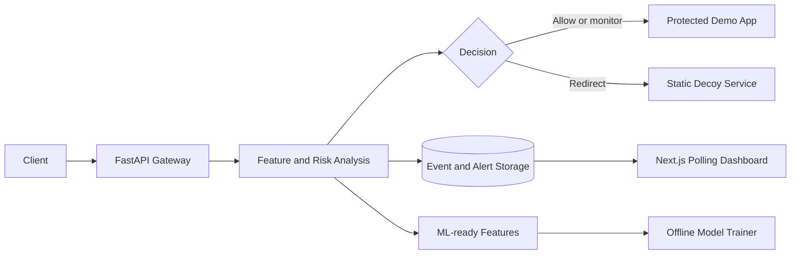

# Project MIRAGE

Project MIRAGE is an experimental cyber-deception platform for API traffic. The
current repository provides a complete MVP: a guarded FastAPI proxy scores requests with
heuristics and Random Forest ML models, forwards normal traffic to a protected demo app, redirects suspicious
traffic to an isolated static decoy, persists security events, and exposes them
through a real-time Next.js dashboard with resilient polling fallback.

See `docs/PROPOSAL_ALIGNMENT.md` for the complete proposal capability matrix.

## What Works

- guarded reverse proxy at `/api/v1/proxy/*`;
- configurable ML routing modes (`ML_ROUTING_MODE=heuristic|hybrid|ml_only`) combining heuristic risk scoring and Random Forest ML confidence;
- isolated protected-demo and adaptive static-decoy services;
- bounded request bodies, upstream timeouts, credential filtering, and rate limits;
- SQLite development storage, PostgreSQL/Alembic, and Supabase cloud pooler configuration (`.env.supabase.example`);
- dashboard metrics, events, alerts, traffic history, and simulation controls;
- authenticated WebSocket dashboard snapshots for events, alerts, metrics,
  traffic, risk history, decoy status, training readiness, ML shadow status,
  honeytokens, canary assignments, and actor/case workflows;
- versioned ML-ready request and bounded payload-shape features, ML shadow scoring,
  and offline/automated Random Forest training pipelines;
- locally reviewed CICIDS2017 DDoS, CSIC 2010, and custom API log splits with 100% benchmark performance;
- cloud deployment configurations for Vercel (`apps/web/vercel.json`) and Railway (`railway.json`);
- analyst event labels for future training data curation;
- JSONL export and readiness checks for analyst-labeled training records;
- repeatable local API-domain training data collection and automated custom API log pipeline (`python scripts/generate_custom_api_dataset.py`);
- honeytoken detection for configured decoy credentials;
- adaptive decoy responses with epoch-rotatable per-actor synthetic canary tokens;
- persistent canary assignment records with hashed token values, operator revoke
  controls, and dashboard visibility;
- persistent actor profiles, lightweight actor clusters, and persisted case triage workflows;
- Docker Compose configuration for the five-service stack.

## Current Boundaries

- The gateway proxies requests under its explicit `/api/v1/proxy/*` route.
- Live traffic routing can use `heuristic`, `hybrid`, or `ml_only` modes depending on `ML_ROUTING_MODE`.
- Decoy payloads are synthetic and can issue deterministic per-actor canary
  tokens with epoch-based rotation; assignment and revoke records exist for
  operator review, but multi-operator approval workflows are not implemented.
- Cloud deployment manifests (`vercel.json`, `railway.json`, `.env.supabase.example`) are ready for deployment.

## Architecture


```mermaid
graph LR
    A[Client] --> B[FastAPI Gateway]
    B --> C[Feature and Risk Analysis]
    C --> D{Decision}
    D -->|Allow or monitor| E[Protected Demo App]
    D -->|Redirect| F[Static Decoy Service]
    C --> G[(Event and Alert Storage)]
    G --> H[Next.js Polling Dashboard]
    C --> I[ML-ready Features]
    I --> J[Offline Model Trainer]
```

| Service | Local port | Purpose |
| --- | ---: | --- |
| Web | `3000` | Landing page, dashboard, and server-side simulation bridge |
| Gateway | `8000` | Inspection, proxy routing, dashboard API, and persistence |
| Protected demo app | `8001` | Upstream for allowed or monitored traffic |
| Decoy | `8002` | Upstream with static synthetic responses |
| PostgreSQL | internal | Compose persistence backend |

## Quick Start

### Prerequisites

- Docker Desktop with Docker Compose; or
- Node.js 20+ and Python 3.11+ for standalone development.

### Full Stack With Docker

From the repository root:

```bash
# Windows
Copy-Item .env.example .env

# Linux/macOS
cp .env.example .env
```

Fill every variable marked `REQUIRED` in `.env`:

- `POSTGRES_PASSWORD` must be strong and URL-safe.
- `DATABASE_URL` must use the `postgresql+asyncpg` driver, host `db`, and the
  same user, password, and database configured by `POSTGRES_*`.
- `MIRAGE_API_KEY` protects every dashboard endpoint and stays server-side.
- `MIRAGE_OPERATOR_PASSWORD` is the shared operator login (16+ characters).
- `MIRAGE_OPERATOR_SESSION_SECRET` and `MIRAGE_DASHBOARD_TICKET_SECRET` must be
  independent random values of at least 32 characters.
- `MIRAGE_DASHBOARD_WS_URL` is the browser-reachable stream URL; use `wss://`
  and set `MIRAGE_SECURE_COOKIES=true` for HTTPS staging.
- `DECOY_*` values must be synthetic and invalid on every real system.
- `DECOY_CANARY_EPOCH` can be increased when rotating newly issued canary
  tokens.

Then start the stack:

```bash
docker compose --env-file .env -f infra/docker-compose.yml up --build
```

Open:

- dashboard: `http://localhost:3000/dashboard` by default, or the port set in
  `WEB_PORT`;
- gateway docs: `http://localhost:8000/docs`;
- gateway health: `http://localhost:8000/health`.

Stop the stack with:

```bash
docker compose --env-file .env -f infra/docker-compose.yml down
```

The root `.env` is ignored by Git. Commit variable names and documentation only
through `.env.example`.

## Demo

With the full stack running, send normal traffic through the proxy:

```bash
curl -H "User-Agent: Mozilla/5.0" http://localhost:8000/api/v1/proxy/api/products
```

Send a suspicious probe to exercise decoy routing:

```bash
curl -H "User-Agent: sqlmap/1.8" http://localhost:8000/api/v1/proxy/.env
```

Open `http://localhost:3000/dashboard` to inspect the resulting events and
alerts. The dashboard simulation buttons call a server-side Next.js route, so
`MIRAGE_API_KEY` is never exposed in the browser bundle.

For a direct operator simulation call:

```bash
curl -X POST -H "X-Mirage-API-Key: YOUR_LOCAL_MIRAGE_API_KEY" http://localhost:8000/api/v1/simulate/suspicious
```

## Standalone Development

Run each backend service in a separate terminal from the repository root.

### Gateway

```bash
cd apps/gateway
python -m venv .venv
# Windows: .venv\Scripts\activate
# Linux/macOS: source .venv/bin/activate
python -m pip install -e ".[dev,ml,postgres]"
# Windows: Copy-Item .env.example .env
# Linux/macOS: cp .env.example .env
python -m alembic upgrade head
uvicorn app.main:app --reload --port 8000
```

### Protected Demo App

```bash
cd apps/real-app-demo
python -m pip install -e .
uvicorn app.main:app --reload --port 8001
```

### Decoy

```bash
cd apps/decoy
python -m pip install -e .
uvicorn app.main:app --reload --port 8002
```

### Web

Copy `apps/web/.env.example` to `apps/web/.env.local`. Set
`MIRAGE_INTERNAL_API_URL` to the standalone gateway and use the same
`MIRAGE_API_KEY` configured by the gateway.

```bash
cd apps/web
npm install
# Windows: Copy-Item .env.example .env.local
# Linux/macOS: cp .env.example .env.local
npm run dev
```

## Gateway API

All paths below use the `http://localhost:8000` base URL.

| Method and path | Auth | Purpose |
| --- | --- | --- |
| `GET /health` | Public | Health check |
| `POST /api/v1/inspect` | API key | Inspect submitted request metadata |
| `* /api/v1/proxy/{path}` | Public | Inspect and forward real HTTP traffic |
| `POST /api/v1/simulate/normal` | API key | Generate a normal demo event |
| `POST /api/v1/simulate/suspicious` | API key | Generate a suspicious demo event |
| `GET /api/v1/dashboard/*` | Public | Dashboard metrics, events, alerts, and charts |
| `GET /api/v1/dashboard/training-data/export` | API key | Export analyst-labeled feature vectors as JSONL |
| `GET /api/v1/dashboard/training-data/summary` | API key | Check labeled row counts and class balance before training |
| `POST /api/v1/dashboard/training-data/retrain` | API key | Train a local shadow-mode candidate artifact from analyst labels |
| `GET /api/v1/dashboard/ml-shadow/status` | Public | Report sanitized ML shadow artifact readiness |
| `GET /api/v1/dashboard/ml-shadow/summary` | Public | Summarize recent model-only agreement with live routing |
| `GET /api/v1/dashboard/ml-promotion/readiness` | API key | Evaluate guarded promotion prerequisites without changing routing |
| `GET /api/v1/dashboard/honeytokens` | Public | Show recent decoy credential interactions |
| `GET /api/v1/dashboard/canary-assignments` | Public | Show issued canary assignment lifecycle records |
| `POST /api/v1/dashboard/canary-assignments/{assignment_id}/revoke` | API key | Revoke a canary assignment for operator lifecycle tracking |
| `GET /api/v1/dashboard/actors` | Public | Show recent actor profiles grouped by threat fingerprint |
| `GET /api/v1/dashboard/actor-clusters` | Public | Show lightweight actor clusters for triage |
| `GET /api/v1/dashboard/actor-cases` | Public | Show recommended investigation cases |
| `GET /api/v1/dashboard/actor-case-workflows` | Public | Show persisted actor case workflow records, optionally filtered by status or assignee |
| `POST /api/v1/dashboard/actor-cases/{case_id}/open` | API key | Open a recommended actor case workflow |
| `PATCH /api/v1/dashboard/actor-case-workflows/{case_id}` | API key | Update an actor case workflow status |
| `WS /api/v1/dashboard/ws` | API key token | Stream dashboard event and alert updates |
| `GET /api/v1/decoy/status` | Public | Current decoy metrics |
| `POST /api/v1/decoy/respond` | API key | Generate an in-process synthetic response |

Send protected requests with `X-Mirage-API-Key`. Docker Compose refuses to start
without `MIRAGE_API_KEY`; standalone development permits it to be unset.

## Tests and Checks

```bash
cd apps/gateway
python -m pytest tests -q
```

```bash
cd apps/web
npm run lint
npm run build
```

Validate Compose after filling `.env`:

```bash
docker compose --env-file .env -f infra/docker-compose.yml config --quiet
```

## Offline & Automated ML Pipeline

Training accepts JSON Lines records with a numeric `features` object and binary `label` (`0` normal, `1` suspicious):

Prepare a reviewed dataset split first:

```bash
cd apps/gateway
python scripts/prepare_dataset.py \
  --source mirage-jsonl \
  --input data/raw/runtime/training_events.jsonl \
  --output-dir data/prepared/runtime-v1 \
  --dataset-name runtime-export \
  --dataset-version v1
```

For production-like Custom API logs, run the end-to-end automated pipeline:

```bash
cd apps/gateway
python scripts/generate_custom_api_dataset.py
```

This generates raw logs, performs metadata attestation, validates quality/provenance, creates dataset splits, trains a Random Forest risk model, and verifies promotion readiness.

## Repository Layout

```text
apps/
  web/             Next.js dashboard and server-side simulation bridge
  gateway/         FastAPI gateway, persistence, migrations, ML tooling, tests
  real-app-demo/   Protected upstream used by the proxy demo
  decoy/           Isolated static synthetic upstream
docs/
  architecture.md
  demo-flow.md
  PROPOSAL_ALIGNMENT.md
infra/
  docker-compose.yml
```

## Documentation

- `docs/architecture.md`: implemented and target architecture boundaries;
- `docs/actor-profiles.md`: actor profile aggregation and current boundaries;
- `docs/configuration.md`: environment files, variable scopes, and secret handling;
- `docs/dataset-preparation.md`: raw dataset adapters, splits, and readiness rules;
- `docs/demo-flow.md`: concise end-to-end demonstration;
- `docs/honeytokens.md`: decoy credential tracking and current boundaries;
- `docs/model-artifacts.md`: artifact review and shadow-mode activation;
- `docs/PROPOSAL_ALIGNMENT.md`: proposal capability matrix and safe claims;
- `apps/gateway/README.md`: gateway-specific development notes;
- `apps/web/README.md`: frontend-specific commands.

## License

This project is developed for educational and demonstration purposes.
