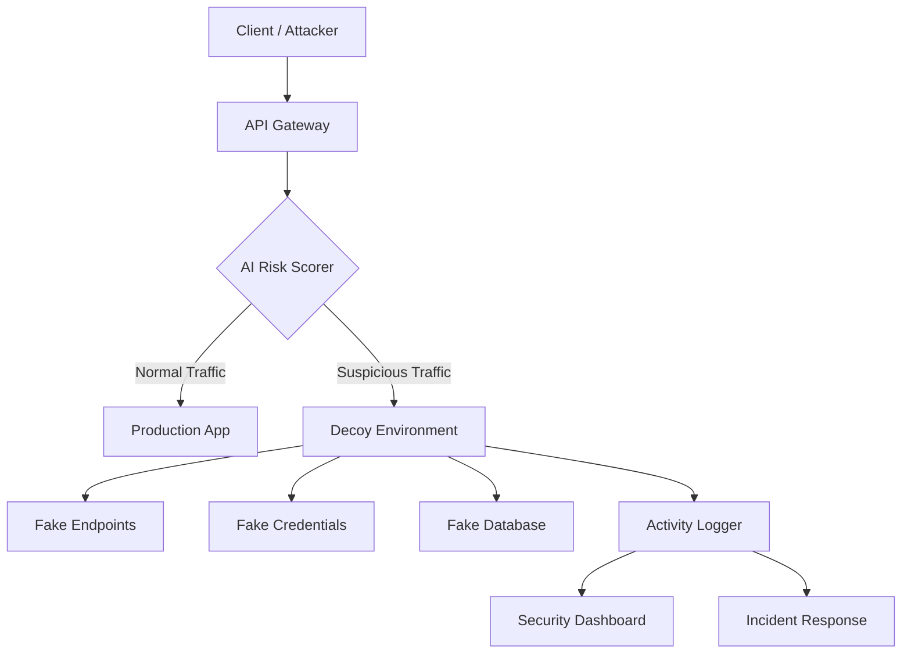

# Project MIRAGE — Architecture

## Overview

Project MIRAGE is an AI-powered cyber deception defense platform for API security. The platform detects suspicious API requests, calculates risk scores, redirects attackers into safe decoy environments, records attacker behavior, and visualizes threats through a security dashboard.

## Architecture

## Components

| Component | Directory | Status | Description |
|-----------|-----------|--------|-------------|
| Web (Frontend) | `apps/web` | Active | Next.js landing page + security dashboard |
| Gateway | `apps/gateway` | Active | FastAPI defense gateway with risk scoring, anomaly detection, and decoy routing |
| Decoy Service | `apps/decoy` | Planned | Decoy routing and fake environment management |
| Demo App | `apps/real-app-demo` | Planned | Protected demo application |
| Shared | `packages/shared` | Planned | Shared types and constants |

## Core Concepts

- **AI Risk Scoring** — Evaluates incoming requests for anomaly indicators
- **Anomaly Detection** — Identifies patterns that deviate from normal traffic
- **Threat Fingerprinting** — Records behavioral signatures from trapped attackers
- **Decoy Environment** — Isolated sandbox mimicking production systems
- **Fake Endpoint** — Simulated API routes returning fabricated data
- **Fake Credential** — Honeytoken credentials that trigger alerts when used
- **Fake Response** — Realistic but fabricated API responses
- **Activity Logger** — Records all attacker interactions within decoy
- **Security Dashboard** — Real-time visualization of threats and system status
- **Incident Response** — Automated alerting and containment workflows
