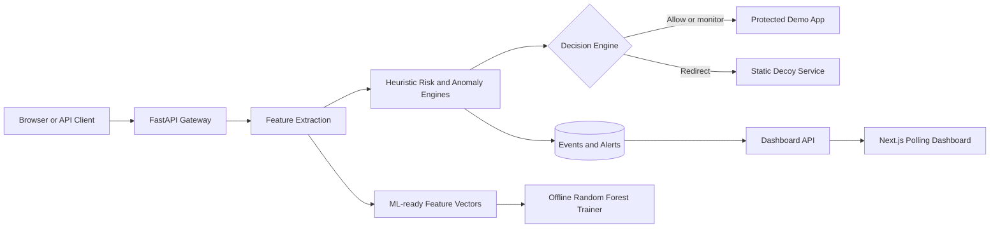
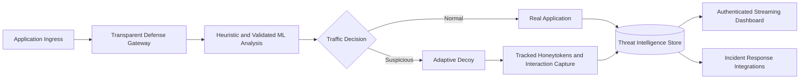

# MIRAGE Architecture

## Implemented MVP

The gateway only proxies requests received under `/api/v1/proxy/*`. Inspection,
simulation, dashboard, and decoy-management routes remain separate APIs.

## Request Path

1. The gateway reads a bounded request body and extracts path, query, user-agent,
   request-frequency, and payload indicators.
2. Heuristic risk and anomaly engines produce a decision: `allow`, `monitor`, or
   `redirect_to_decoy`.
3. Allowed and monitored requests go to the protected demo app. Redirected
   requests go to the isolated static decoy.
4. The gateway persists the event, optional alert, and numeric feature vector.
5. The dashboard reads aggregate and recent data every 10 seconds.

## Trust Boundaries

- Upstream URLs come only from server configuration; clients cannot choose a host.
- Hop-by-hop headers are never forwarded.
- Decoy forwarding uses an allowlist and removes cookies, authorization values,
  and `X-Mirage-API-Key`.
- Operator write endpoints require `X-Mirage-API-Key` in Docker deployments.
- Browser simulations pass through a server-side Next.js route. The operator key
  is not exposed through a `NEXT_PUBLIC_*` variable.
- Request body size, upstream timeout, rate limit, and tracked-source count are bounded.

## Persistence

Standalone development defaults to SQLite. Docker Compose uses PostgreSQL and
runs Alembic migrations before starting the gateway. Events include the extracted
feature vector used by the offline training workflow.

## Target Architecture

This target is not implemented yet. See `docs/PROPOSAL_ALIGNMENT.md` for the
capability-by-capability gap.
