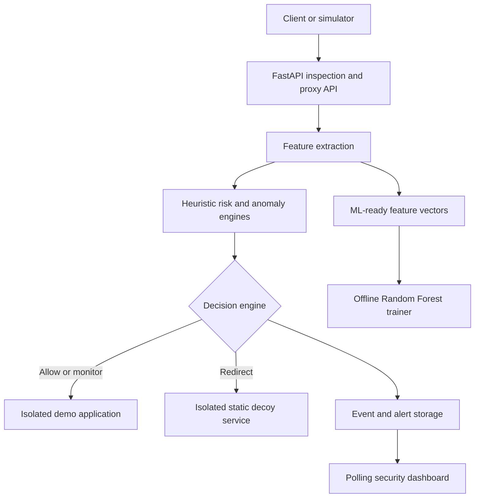
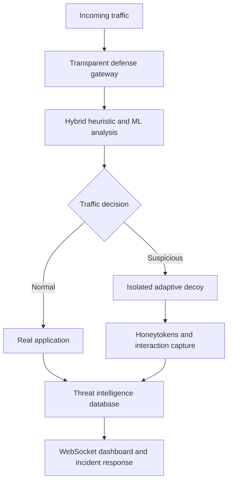

# Project MIRAGE - Architecture

## Implemented MVP

The gateway evaluates submitted metadata and forwards requests received under
`/api/v1/proxy/*`. It does not yet intercept arbitrary application ingress.

## Target Architecture From The Proposal

See `docs/PROPOSAL_ALIGNMENT.md` for the exact implementation gap.
