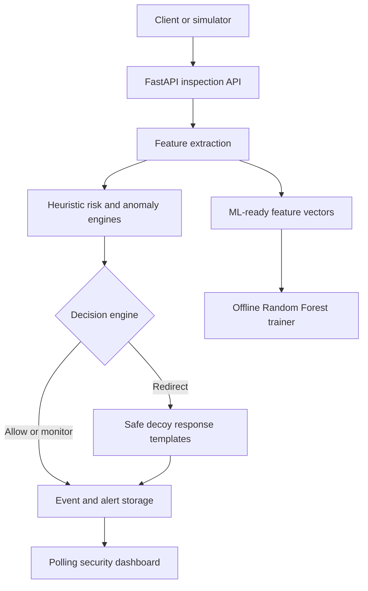
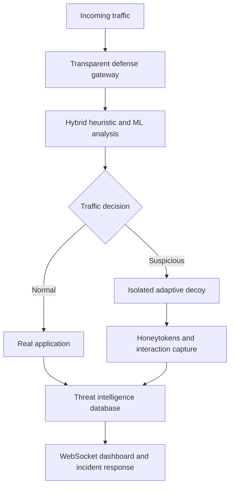

# Project MIRAGE - Architecture

## Implemented MVP

The gateway currently evaluates submitted request metadata. It does not yet
forward arbitrary traffic to a protected application or isolated decoy service.

## Target Architecture From The Proposal

See `docs/PROPOSAL_ALIGNMENT.md` for the exact implementation gap.
